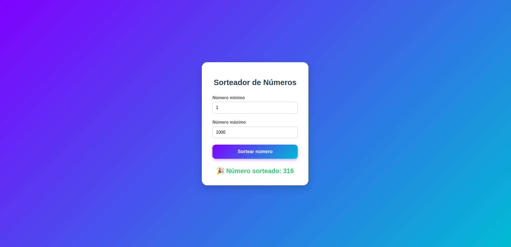

# 🎲 Sorteador de Números

Um sorteador simples, bonito e animado feito com HTML, CSS e JavaScript — ideal para rifas, sorteios e brincadeiras!



## ✨ Funcionalidades

- Define número mínimo e máximo
- Animação estilo "roleta" que desacelera até o número final
- Layout responsivo e visual moderno
- Validações de entrada com mensagens de erro

## 🖼 Preview

> Veja o resultado final com animação no navegador! Basta abrir o arquivo `index.html`.

## 🚀 Como usar

1. Clone o repositório:

```bash
git clone https://github.com/januariod/sorteador-de-numeros.git
```

## 🛠 Tecnologias usadas

- **HTML5**
- **CSS3**
  - Gradiente de fundo
  - Estilização responsiva
  - Card moderno com sombra e contraste
- **JavaScript**
  - DOM API
  - `requestAnimationFrame` para animações suaves
  - Lógica de sorteio com desaceleração

---

## 💡 Possíveis melhorias

- 🔉 Adicionar efeitos sonoros durante o sorteio
- 📜 Histórico de sorteios anteriores
- 🔁 Impedir repetição de números já sorteados
- 🕹 Botão “Sortear novamente”
- 🌙 Tema escuro
- 🎲 Suporte a múltiplos números sorteados de uma vez

---

## 🤝 Contribuindo

Contribuições são muito bem-vindas!  
Se você quiser ajudar a melhorar esse projeto:

1. Faça um fork
2. Crie uma branch com sua feature: `git checkout -b minha-melhoria`
3. Commit suas mudanças: `git commit -m 'feat: adiciona nova funcionalidade'`
4. Envie um PR 🚀

Ou abra uma [issue](https://github.com/januariod/sorteador-de-numeros/issues) com sugestões e bugs!

---

## 📄 Licença

Este projeto está licenciado sob os termos da [MIT License](LICENSE).
